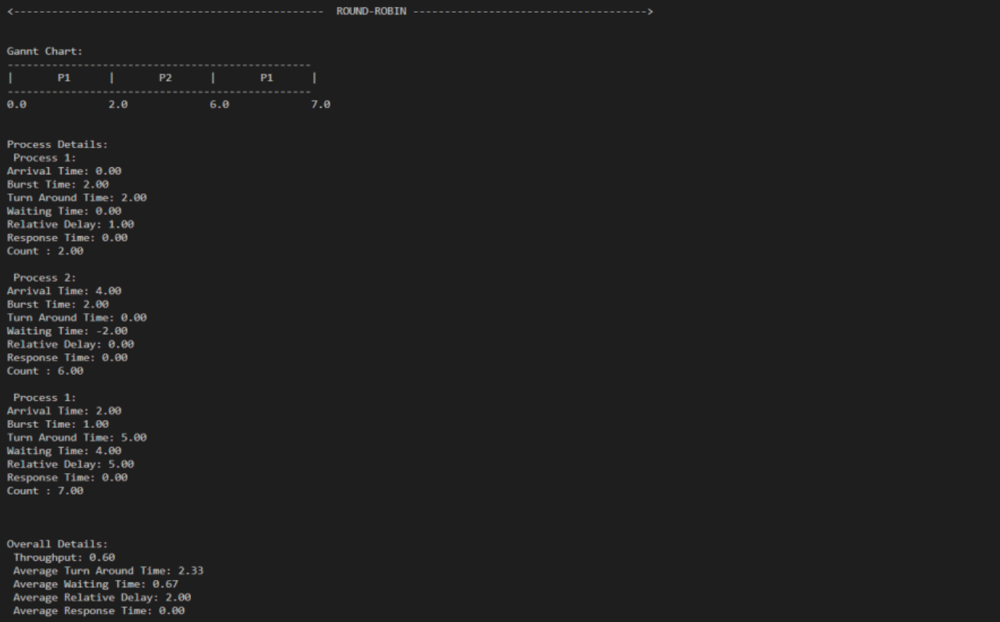

# Operating-System

The goal of the project is to implement a process scheduling simulation software in an operating system.  
To achieve this, the FIFO, SJF, and round-robin algorithms are utilized.  
The project involves creating a simulation input (cycles of I/O and CPU) as well as textual or graphical output.  
Licence 3 project made for the Operating System cursus at CY Paris Université.  
Made with Mian Farooq.

Here, an example of what the simulation do :  

